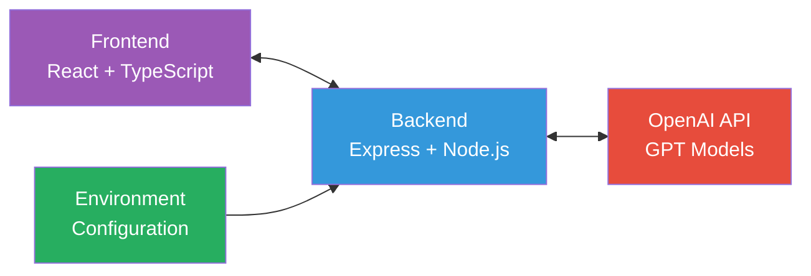
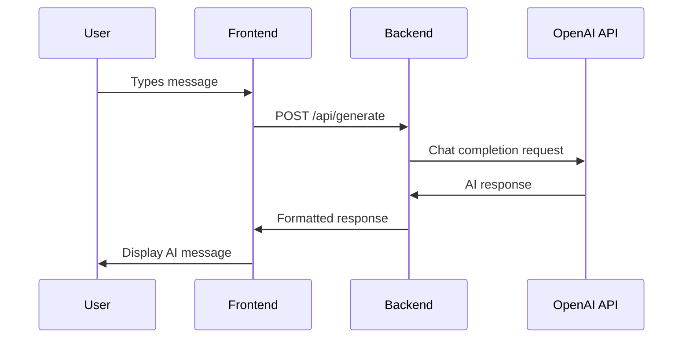
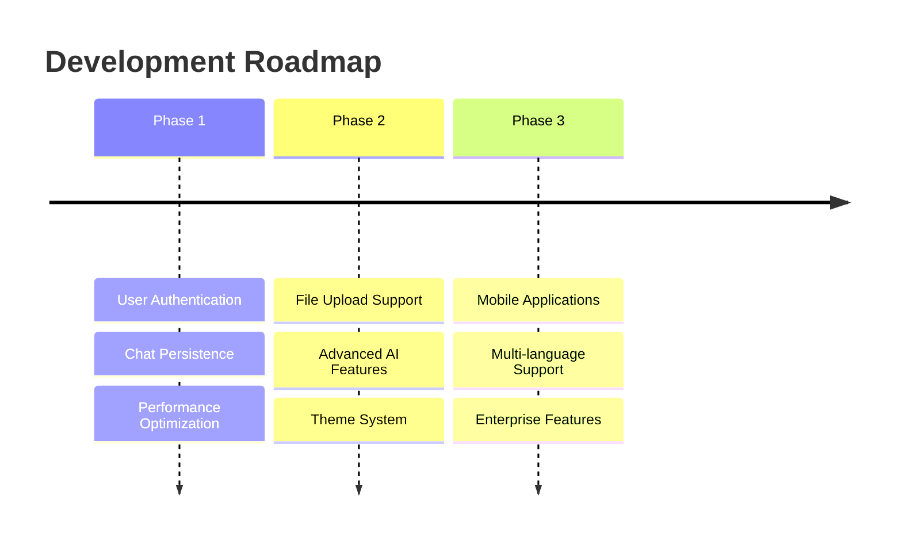

# 🤖 Gemini AI Application - System Design Document


## 📋 Project Overview

**Project Name:** Gemini AI Application  
**Repository:** [github.com/Anjali8875/Anjali-tech---assignment-i-am-beside-u](https://github.com/Anjali8875/Anjali-tech---assignment-i-am-beside-u)  
**Technology Stack:** React + TypeScript + Node.js + Express + OpenAI API  
**Purpose:** A full-stack AI-powered chat application that provides intelligent responses using OpenAI's GPT models with a modern, responsive user interface.

### 🌟 Key Features

| Feature | Description |
|---------|-------------|
| 🎨 **Modern UI/UX** | React-based interface with responsive design |
| 🤖 **AI Integration** | OpenAI GPT models for intelligent responses |
| 💬 **Real-time Chat** | Interactive chat interface with message history |
| 📱 **Cross-platform** | Works on desktop and mobile devices |
| 🔒 **Secure** | Environment variables and API key protection |
| ⚡ **Fast Development** | Vite for fast builds and hot module replacement |

## 🏗️ System Architecture

### High-Level Architecture



### Component Breakdown

| Component | Technology | Port | Purpose |
|-----------|------------|------|---------|
| **Frontend Client** | React + TypeScript + Vite | 5173 | User interface and client-side logic |
| **Backend API** | Node.js + Express | 3000 | API server and business logic |
| **AI Service** | OpenAI GPT API | HTTPS | AI response generation |
| **Configuration** | Environment Variables | - | API keys and settings |

## 💻 Technology Stack

### Frontend Technologies
- **React 19.1.0** - UI Framework
- **TypeScript 5.8.3** - Type Safety
- **Vite 6.3.5** - Build Tool & Dev Server
- **Tailwind CSS 4.1.6** - Utility-first CSS Framework
- **React Markdown 10.1.0** - Markdown Rendering
- **Highlight.js 11.11.1** - Code Syntax Highlighting

### Backend Technologies
- **Node.js** - JavaScript Runtime
- **Express 5.1.0** - Web Framework
- **OpenAI 5.20.2** - AI API Integration
- **CORS 2.8.5** - Cross-Origin Resource Sharing
- **dotenv 17.2.2** - Environment Variable Management

### Development Tools
- **ESLint 9.26.0** - Code Linting
- **TypeScript ESLint** - TypeScript Linting
- **Git** - Version Control
- **npm** - Package Management
- **VS Code** - Recommended IDE

## 📁 Project Structure

```
gemini-ai/
├── 📁 public/                 # Static assets
│   └── vite.svg
├── 📁 server/                 # Backend application
│   ├── .env                   # Environment variables (gitignored)
│   ├── .env.example          # Environment template
│   ├── package.json          # Backend dependencies
│   └── server.js             # Express server
├── 📁 src/                    # Frontend source code
│   ├── 📁 assets/            # Images and icons
│   │   ├── anjaliTech.jpeg
│   │   ├── bulb_icon.png
│   │   ├── code_icon.png
│   │   ├── compass_icon.png
│   │   ├── gallery_icon.png
│   │   ├── gemini_icon.png
│   │   ├── history_icon.png
│   │   ├── menu_icon.png
│   │   ├── message_icon.png
│   │   ├── mic_icon.png
│   │   ├── plus_icon.png
│   │   ├── question_icon.png
│   │   ├── send_icon.png
│   │   ├── setting_icon.png
│   │   ├── user_icon.png
│   │   └── youtube_icon.png
│   ├── 📁 component/         # React components
│   │   ├── 📁 Main/          # Main chat component
│   │   │   └── Main.tsx
│   │   ├── 📁 sideBar/       # Sidebar component
│   │   │   └── sideBar.tsx
│   │   └── cart.tsx
│   ├── 📁 config/            # Configuration files
│   │   └── gemini.ts         # API configuration
│   ├── 📁 ContextFile/       # React context
│   │   └── Context.tsx
│   ├── App.tsx               # Main App component
│   ├── main.tsx              # App entry point
│   ├── index.css             # Global styles
│   └── vite-env.d.ts         # Vite type definitions
├── .gitignore                # Git ignore rules
├── eslint.config.js          # ESLint configuration
├── index.html                # HTML template
├── package.json              # Frontend dependencies
├── README.md                 # Project documentation
├── tsconfig.json             # TypeScript config
├── tsconfig.app.json         # App-specific TypeScript config
├── tsconfig.node.json        # Node-specific TypeScript config
└── vite.config.ts            # Vite configuration
```

## 🔄 Data Flow & API Design

### Request Flow



### API Endpoints

#### `POST /api/generate`
Generate AI response for user input.

**Request Body:**
```json
{
  "taskType": "general" | "daily" | "code",
  "prompt": "User's input message"
}
```

**Success Response:**
```json
{
  "text": "AI generated response in markdown format"
}
```

**Error Response:**
```json
{
  "error": "Error message description"
}
```

## 🎨 Frontend Architecture

### Component Hierarchy
```
App.tsx
├── Context.tsx (Global State)
├── sideBar/
│   └── sideBar.tsx (Navigation & Controls)
└── Main/
    └── Main.tsx (Chat Interface)
        ├── Message Display
        ├── Input Field
        └── Send Button
```

### Key Frontend Features
- ✅ **Responsive Design** - Adapts to different screen sizes
- ✅ **Real-time Chat** - Interactive message interface
- ✅ **Markdown Rendering** - Formats AI responses with code highlighting
- ✅ **Context Management** - Global state for chat history
- ✅ **Error Handling** - User-friendly error messages
- ✅ **Loading States** - Visual feedback during API calls

### State Management
The application uses React Context API for global state management:

```typescript
// Context Features:
interface AppContext {
  chatHistory: Message[];
  isLoading: boolean;
  error: string | null;
  userPreferences: UserPrefs;
}
```

## ⚙️ Backend Architecture

### Server Configuration
```javascript
// Express Server Features:
✓ CORS enabled for frontend communication
✓ JSON body parsing middleware
✓ Environment variable configuration
✓ Error handling middleware
✓ OpenAI client initialization
✓ API key validation
```

### AI Integration
The backend integrates with OpenAI's GPT models:

```javascript
// OpenAI Configuration:
const client = new OpenAI({
  apiKey: process.env.OPENAI_API_KEY
});

// Features:
- Model: gpt-3.5-turbo or gpt-4
- Max tokens: Configurable
- Temperature: Optimized for chat
- System prompts: Task-specific instructions
- Error handling: Quota and rate limit management
```

### Environment Configuration

| Variable | Purpose | Required | Example |
|----------|---------|----------|---------|
| `OPENAI_API_KEY` | OpenAI API authentication | ✅ Yes | `sk-proj-...` |
| `PORT` | Server port number | ❌ No | `3000` |

## 🔒 Security & Best Practices

### 🔐 Security Measures Implemented

- **Environment Variables:** API keys stored securely in .env files
- **Git Security:** .env files excluded from version control
- **CORS Protection:** Restricted origins for API access
- **Input Validation:** Request body validation and sanitization
- **Error Handling:** Sensitive information not exposed in errors

### Development Best Practices

- **TypeScript:** Type safety throughout the application
- **ESLint:** Code quality and consistency enforcement
- **Component Modularity:** Reusable and maintainable components
- **Error Boundaries:** Graceful error handling in React
- **Loading States:** User feedback during async operations
- **Responsive Design:** Mobile-first approach

### Production Considerations

```bash
# For Production Deployment:
□ Environment variable validation
□ Rate limiting implementation
□ API key rotation strategy
□ Monitoring and logging
□ Build optimization
□ CDN for static assets
□ HTTPS enforcement
□ Database integration (if needed)
```

## 🚀 Installation & Setup

### Prerequisites
- Node.js (version 16 or higher)
- npm or yarn package manager
- OpenAI API Key ([Get one here](https://platform.openai.com/api-keys))

### Local Development Setup

```bash
# 1. Clone the repository
git clone https://github.com/Anjali8875/Anjali-tech---assignment-i-am-beside-u.git
cd Anjali-tech---assignment-i-am-beside-u

# 2. Install frontend dependencies
npm install

# 3. Install backend dependencies
cd server
npm install

# 4. Configure environment
cp .env.example .env
# Edit .env with your OpenAI API key

# 5. Start backend server
node server.js

# 6. Start frontend (in new terminal)
cd ..
npm run dev
```

### Build & Production

```bash
# Build for production
npm run build

# Preview production build
npm run preview

# Production deployment considerations:
- Use process manager (PM2)
- Set up reverse proxy (Nginx)
- Configure SSL certificates
- Set up monitoring
```

## 📊 Performance & Scalability

### Current Performance Characteristics

| Metric | Current State | Optimization Opportunities |
|--------|---------------|----------------------------|
| **Frontend Bundle Size** | ~549KB (minified) | Code splitting, tree shaking |
| **API Response Time** | Depends on OpenAI API | Caching, streaming responses |
| **Concurrent Users** | Limited by OpenAI rate limits | Request queuing, user limits |
| **Memory Usage** | Minimal (stateless server) | Session management for scale |

### Scalability Considerations

- **Horizontal Scaling:** Multiple server instances behind load balancer
- **Database Integration:** User sessions and chat history persistence
- **Caching Layer:** Redis for frequently asked questions
- **CDN Integration:** Static asset delivery optimization
- **API Rate Limiting:** Per-user request limits

## 🔄 Future Enhancements

### Planned Features

| Feature | Description | Priority |
|---------|-------------|----------|
| 👤 **User Authentication** | Login system with personalized chat history | High |
| 💾 **Chat Persistence** | Database integration for chat history | High |
| 🎨 **Theme Customization** | Multiple UI themes and customization | Medium |
| 📁 **File Upload** | Document analysis and processing | Medium |
| 🌐 **Multi-language** | Internationalization support | Low |
| 📱 **Mobile App** | Native mobile applications | Low |

### Technical Roadmap



## 📞 Support & Maintenance

### Monitoring & Logging
- **Error Tracking:** Client and server error monitoring
- **Performance Metrics:** Response times and resource usage
- **API Usage:** OpenAI API call tracking and cost monitoring
- **User Analytics:** Usage patterns and feature adoption

### Maintenance Schedule

| Task | Frequency | Description |
|------|-----------|-------------|
| **Dependency Updates** | Monthly | Update npm packages and security patches |
| **API Key Rotation** | Quarterly | Rotate OpenAI API keys for security |
| **Performance Review** | Quarterly | Analyze metrics and optimize bottlenecks |
| **Backup & Recovery** | Weekly | Backup configurations and data |

## 🐛 Troubleshooting

### Common Issues

<details>
<summary><strong>API Key Issues</strong></summary>

**Problem:** "Insufficient quota" or "Invalid API key" errors

**Solutions:**
1. Check your OpenAI account billing and usage
2. Verify the API key is correctly set in `.env`
3. Ensure the API key has sufficient credits
4. Try regenerating the API key
</details>

<details>
<summary><strong>CORS Errors</strong></summary>

**Problem:** "Failed to fetch" or CORS policy errors

**Solutions:**
1. Verify frontend and backend are running on correct ports
2. Check CORS configuration in `server.js`
3. Ensure frontend URL is included in CORS origins
</details>

<details>
<summary><strong>Build Failures</strong></summary>

**Problem:** npm build or dev server issues

**Solutions:**
1. Clear node_modules and reinstall: `rm -rf node_modules && npm install`
2. Clear npm cache: `npm cache clean --force`
3. Check Node.js version compatibility
</details>

## 📄 Documentation

### Additional Resources

- **[Setup Guide](README.md)** - Quick start instructions
- **[API Documentation](docs/api.md)** - Detailed API reference
- **[Contributing Guidelines](CONTRIBUTING.md)** - How to contribute
- **[Deployment Guide](docs/deployment.md)** - Production deployment

## 📋 Conclusion

The Gemini AI Application represents a modern, well-architected full-stack solution that demonstrates best practices in web development, AI integration, and user experience design. The system is designed with scalability, security, and maintainability in mind.

### Key Strengths

- ✅ Clean, modular architecture with clear separation of concerns
- ✅ Modern technology stack with TypeScript for type safety
- ✅ Secure handling of API keys and environment variables
- ✅ Responsive design that works across devices
- ✅ Comprehensive error handling and user feedback
- ✅ Well-documented codebase with clear setup instructions

This system design provides a solid foundation for future enhancements and can serve as a template for similar AI-powered applications.

---

**Document Version:** 1.0  
**Last Updated:** September 2025  
**Repository:** [github.com/Anjali8875/Anjali-tech---assignment-i-am-beside-u](https://github.com/Anjali8875/Anjali-tech---assignment-i-am-beside-u)